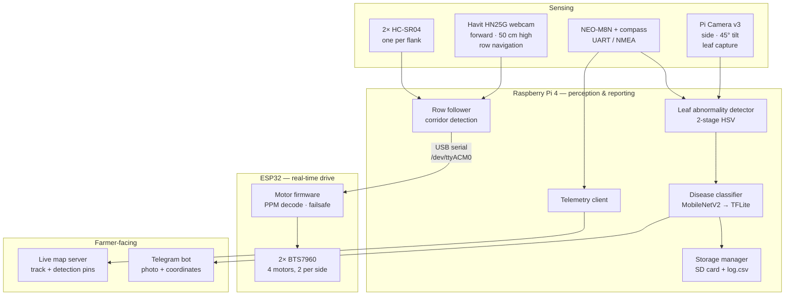

# ACES — Autonomous Crop Evaluation Scout

> A low-cost ground robot that drives itself down crop rows, spots diseased leaves, identifies the disease on-board, and drops a pin on a live map the farmer can open on their phone.

<p align="center">
  
  
  
  
  
</p>

---

## Why this exists

Scouting a field for disease is manual, slow, and easy to get wrong. By the time a blight is obvious from the edge of the plot, it has already spread. Small farms can't justify a drone or a commercial scouting service.

ACES is a build-it-for-parts alternative: a tracked-width UGV that walks the rows on its own, watches the canopy for discoloration, and reports what it finds with a location attached — so the farmer gets a map of *where* the problem is, not just a warning that one exists.

**Total build cost target: under ৳40,000 (~$330).**

---

## What it does

| | |
|---|---|
| 🚜 **Drives the row on its own** | Forward webcam finds the soil corridor between two plant rows and steers to keep centred. Ultrasonic sensors on both flanks stop it before it clips a plant. |
| 🍂 **Sees sick leaves** | Two-stage HSV segmentation: a wide mask isolates plant material, then a narrow healthy-green mask is subtracted. What's left is abnormal tissue. Area ratio crosses a threshold → stop and shoot. |
| 🔬 **Names the disease on-board** | MobileNetV2 fine-tuned on PlantVillage, exported to TFLite and run on the Pi with `tflite-runtime`. No cloud round-trip, no connectivity requirement in the field. |
| 📍 **Tags the location** | NEO-M8N GPS (with onboard compass) over UART, NMEA GGA parsed with `pynmea2`. Duplicate suppression stops the same plant being logged five times. |
| 🗺️ **Reports live** | Position streams to a browser map. Every detection drops a pin carrying the photo and hyperlinked coordinates. |
| 💬 **Pings the farmer** | Leaf photo + location pushed straight to a Telegram group. No app to install. |
| 🎛️ **Tunes from your phone** | The Pi hosts a hotspot and serves **ACES Tuner** — a browser HSV tuning UI reachable from any device on the network. No SSH, no terminal, no monitor in a field. |

---

## System architecture



**Why the split?** The Pi does vision and networking, where a few hundred milliseconds of jitter is harmless. The ESP32 owns the motors, where it isn't — a stalled Python process should never mean a robot that keeps driving.

---

## Hardware

| Subsystem | Part | Notes |
|---|---|---|
| Compute (high level) | Raspberry Pi 4 | Vision, classification, telemetry, tuner web server |
| Compute (real time) | ESP32 | Motor control, PPM decode, failsafe |
| Drive | 4× DC gear motor | Two paralleled per side, skid steer |
| Motor drivers | 2× BTS7960 / IBT-2 | `R_EN` / `L_EN` driven from GPIO, not tied high |
| Power | LiPo direct to drivers + buck converter | 5 V logic rail held separate from the motor rail |
| Navigation camera | Havit HN25G HD webcam | Forward, mounted 50 cm above ground |
| Leaf camera | Pi Camera v3 | Side-mounted at 45°, single side |
| GPS | NEO-M8N "puck" with compass | 6-wire pigtail; magnetometer on the I²C pair |
| Obstacle sensing | 2× ultrasonic | One per flank |
| Manual override | FlySky FS-iA6B receiver | PPM on a single pin |
| Chassis | Custom welded frame | Fabricated locally; 32 cm overall width |

### ESP32 pinout

| Signal | GPIO |
|---|---|
| PPM input (all channels, interrupt-decoded) | 16 |
| Left driver RPWM / LPWM | 32 / 33 |
| Right driver RPWM / LPWM | 14 / 26 |

> **Why PPM?** Individual PWM channel pins and i-BUS both gave unusable data on this receiver. PPM decodes all channels off one wire with a hand-rolled interrupt handler and no library dependency. See [`docs/rc-link.md`](docs/rc-link.md).

### Geometry constraints

- Robot width: **32 cm**
- Working row gap: **40–45 cm**
- Usable lateral margin: **~4–6 cm per side** — tight enough that steering correction has to be gentle and continuous, not bang-bang.
- The leaf camera looks at one side only, so **each row is traversed twice**, once per direction.

---

## Repository layout

> 

```
aces/
├── pi/
│   ├── main_pipeline.py              # top-level run loop
│   ├── leaf_abnormality_detector.py  # two-stage HSV segmentation
│   ├── disease_classifier.py         # TFLite inference
│   ├── gps_reader.py                 # NEO-M8N UART + pynmea2
│   ├── storage_manager.py            # image naming, log.csv, dedup
│   ├── summary_report.py             # end-of-run report
│   ├── hsv_tuner.py                  # ACES Tuner web UI
│   └── train_disease_classifier.py   # MobileNetV2 transfer learning
├── esp32/
│   └── FLYSKY_ESP32_RC_BTS7960/      # drive firmware
├── server/
│   ├── map_server/                   # live tracking + detection pins
│   └── telegram_bot/                 # farmer notifications
├── tests/
│   └── test_pipeline_no_gps.py       # bench run without a GPS fix
├── data/
│   ├── images/                       # confident detections
│   ├── uncertain/                    # low-confidence, flagged for review
│   └── log.csv                       # timestamp, coords, class, confidence, severity
└── models/
    └── disease_classifier.tflite
```

---

## Quick start

> 

### 1. Flash the drive firmware

```bash
# Open esp32/FLYSKY_ESP32_RC_BTS7960/ in the Arduino IDE
# Board: ESP32 Dev Module · Upload
```

Bind the transmitter and confirm all four motors respond to stick input before going any further. If the robot doesn't drive under manual control, autonomy won't save it.

### 2. Set up the Pi

```bash
git clone https://github.com/<your-username>/aces.git
cd aces
python3 -m venv .venv && source .venv/bin/activate
pip install -r requirements.txt
```

Enable the camera and serial port:

```bash
sudo raspi-config   # Interface Options → Camera, Serial (login shell OFF, hardware ON)
```

### 3. Tune the detector

```bash
python pi/hsv_tuner.py
```

Connect any phone or laptop to the Pi's hotspot and open `http://<pi-ip>:5000`. Adjust the plant-material and healthy-green masks until abnormal tissue lights up cleanly against the background, then save the profile.

**Tune under the light you'll actually run in.** Values that work indoors under a flashlight do not survive open sunlight — this is the single most common failure mode on this project.

### 4. Bench test without GPS

```bash
python tests/test_pipeline_no_gps.py
```

Confirms detection → classification → storage works before you take anything outside.

### 5. Full run

```bash
python pi/main_pipeline.py
```

---

## Detection pipeline

1. **Frame capture** from the side camera.
2. **Wide mask** — broad HSV range covering all plant material, healthy or not. Everything outside this is background and is discarded.
3. **Narrow mask** — tight HSV range for healthy green.
4. **Subtract** — `abnormal = wide − narrow`. Yellow, brown, and necrotic black tissue survive.
5. **Area ratio** — `abnormal_px / plant_px`. Above threshold, the robot stops.
6. **Capture** a clear still (the platform is stationary, so no motion blur).
7. **Classify** with the TFLite model. Low-confidence results route to `data/uncertain/` instead of being reported as fact.
8. **Log and report** — image renamed to the predicted disease, row appended to `log.csv`, pin pushed to the map, message sent to Telegram.
9. **Resume.**

The two-stage subtraction exists because a single "find yellow" mask picks up soil, dry stubble, and sunlit dirt indiscriminately. Anchoring to plant material first is what makes the abnormal mask meaningful.

---

## Project status

This is an **active undergraduate prototype**, not production agricultural equipment. Honest state of play:

**Working**
- ✅ Chassis assembled, four-motor drive running under RC control
- ✅ Disease classifier trained and running on-device via TFLite
- ✅ Detector tuned and reliable for a single leaf in controlled light
- ✅ ACES Tuner browser UI live over the Pi hotspot
- ✅ GPS parsing, location-tracking server, and Telegram bot all built
- ✅ ESP32 flashed with autonomous firmware and talking to the Pi over USB serial

**In progress**
- 🔧 Multi-leaf detection tuning across varied angles and backgrounds
- 🔧 Field-light robustness — indoor tuning does not transfer outdoors
- 🔧 Row following: first outdoor attempt failed on a grass lawn, where the path itself is green and no soil corridor exists to track. Purpose-built test bed with leaf panels on both flanks is next.
- 🔧 Map server and Telegram bot are built but not yet field-tested end to end

**Planned**
- 📋 Auto-calibration: robot roams, captures ~100 canopy frames, derives detector thresholds from them, manual override retained
- 📋 Single unified run file — row following + live tracking + detection pins in one process
- 📋 Back-up-and-retry when a capture comes out unusable
- 📋 Wheel encoder + IR sensor for end-of-row turning
- 📋 3D-printed enclosure housing 2 batteries, 2 drivers, Pi, GPS, ESP32, 2 buck converters, and wiring

---

## Known issues

| Issue | Status |
|---|---|
| Motors cut out and recover at full throttle | Traced to the failsafe firing on dropped/corrupt PPM frames, not driver shutdown. Battery terminals sag under load while the 5 V logic rail holds. Under investigation. |
| Reverse-side stick diagonals read mirrored | Sign convention in the mixer; unfixed. |
| Outdoor detection accuracy | Sunlight shifts the HSV distribution far enough that indoor profiles fail. Auto-calibration is the intended fix. |
| Row navigation on uniform-green ground | The corridor detector needs a non-green path. Fails on grass by design. |

---

## Team

Built for a 3-1 semester project, Department of Mechanical Engineering, **BUET**.

- Adittya Das
- Al Jawad
- Samad Shahriar
- Shimanta Das

---

## Acknowledgements

- [PlantVillage Dataset](https://github.com/spMohanty/PlantVillage-Dataset) — training data for the disease classifier
- MobileNetV2 (Sandler et al., 2018) — classification backbone
- OpenCV, TensorFlow Lite, `pynmea2`

---

## License

MIT — see [LICENSE](LICENSE).
