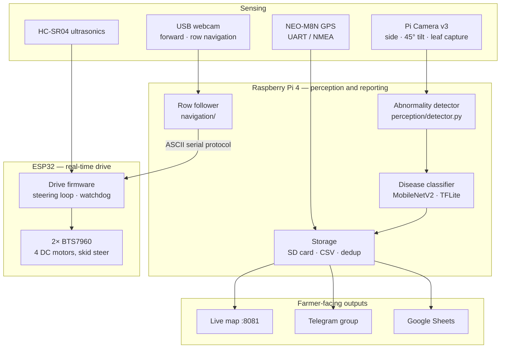

# ACES — Autonomous Crop Evaluation Scout

> A low-cost ground robot that drives itself down crop rows, detects diseased leaves, identifies the disease on-board, and reports each finding — photo and GPS location — to a live map and the farmer's Telegram group.

<p align="center">
  
  
  
  
  
</p>

---

## Table of contents

1. [Overview](#overview)
2. [Key features](#key-features)
3. [System architecture](#system-architecture)
4. [Hardware](#hardware)
5. [Repository structure](#repository-structure)
6. [Getting started](#getting-started)
7. [Run modes](#run-modes)
8. [Bring-up procedure](#bring-up-procedure)
9. [Detection pipeline](#detection-pipeline)
10. [Design principles](#design-principles)
11. [Operating constraints](#operating-constraints)
12. [Project status and limitations](#project-status-and-limitations)
13. [Additional documentation](#additional-documentation)
14. [Team](#team)
15. [Acknowledgements](#acknowledgements)
16. [License](#license)

---

## Overview

Manual disease scouting is slow, labour-intensive and error-prone. By the time a blight is visible from the edge of a plot, it has usually spread. Drones and commercial scouting services are out of reach for most smallholder farms.

**ACES** is an affordable, build-from-parts alternative. It is an unmanned ground vehicle (UGV) that:

- travels between crop rows autonomously,
- inspects the canopy for discoloured or necrotic tissue,
- classifies the disease on-device with no cloud dependency, and
- reports **where** the problem is, not just that one exists.

**Build cost target:** under ৳40,000 (~US $330).

---

## Key features

| Capability | Description |
|---|---|
| **Autonomous row following** | A forward webcam locates the inner edge of each crop wall and steers to the centreline, using a near band for cross-track error and a far band for heading error. Side sonars are fused in when vision confidence drops. |
| **Obstacle handling** | Three ultrasonic sensors drive a slow → stop → wait → reverse-out escalation policy suited to a row with only centimetres of clearance. |
| **Leaf abnormality detection** | Leaf-first segmentation with hole filling, followed by a hue-based lesion rule. Shadow and glare are excluded rather than misread as disease. |
| **On-board disease classification** | MobileNetV2 fine-tuned on PlantVillage, exported to TensorFlow Lite and run on the Raspberry Pi. |
| **Geotagging** | NEO-M8N GPS over UART with a fix-quality gate and 3 m duplicate suppression, so one diseased plant produces one pin. |
| **Live reporting** | Browser-based live map (`:8081`) with detection pins, including an offline "Survey" view that needs no map tiles. Live detection view on `:8080`. |
| **Farmer notifications** | Leaf photo, diagnosis and a Google Maps link sent to a Telegram group through a non-blocking queue. |
| **Data logging** | Structured SD-card layout, CSV log and optional Google Sheets sync that buffers while offline. |
| **Confidence gating** | Low-confidence or mostly unjudgeable results are stored in `data/uncertain/` for review and never sent to the farmer. |

---

## System architecture

The system is split between two controllers. The **Raspberry Pi** decides *what* to do (perception, classification, mission logic, reporting). The **ESP32** decides *how* to move (motor PWM, sensor timing, real-time steering and failsafes).



**Why the split?** Linux is not real-time. If the classifier stalls the Pi for 300 ms mid-row, a Pi-driven steering loop would drive into the crop. The ESP32 keeps steering on the last valid estimate, reduces speed when that estimate goes stale, and stops on its own if the Pi falls silent.

---

## Hardware

| Subsystem | Component | Notes |
|---|---|---|
| High-level compute | Raspberry Pi 4 (Bookworm) | Vision, classification, telemetry, web servers |
| Real-time compute | ESP32 | Motor control, sensor timing, failsafe |
| Drive | 4× DC gear motors | Two per side, skid steer |
| Motor drivers | 2× BTS7960 / IBT-2 | `R_EN` / `L_EN` driven from GPIO |
| Navigation camera | USB webcam | Forward-facing |
| Leaf camera | Pi Camera Module v3 | Side-mounted at 45° |
| Positioning | NEO-M8N GPS (with compass) | GPS on UART; compass I²C lines unused |
| Proximity sensing | HC-SR04 ultrasonics | Fired round-robin, never on a shared trigger |
| Manual override | FlySky FS-iA6B receiver | CH5 selects manual RC or autonomous mode |
| Power | LiPo + buck converter | 5 V logic rail isolated from the motor rail |
| Chassis | Custom welded frame | 32 cm overall width |

> **Pin-map warning.** The default encoder pins in `firmware/aces_drive_esp32` (GPIO 32/33) collide with the existing BTS7960 wiring (32/33 left, 14/26 right). Reconcile the pin map against your wiring harness before flashing an assembled robot.

---

## Repository structure

```
ACES/
├── config/
│   ├── settings.py              All tunable constants — no magic numbers elsewhere
│   └── secrets.example.py       Template for tokens; copy to secrets.py
├── perception/
│   ├── detector.py              Leaf-first segmentation + hue-based lesion rule
│   ├── classifier.py            TFLite MobileNetV2 disease classifier
│   └── disease_camera.py        Pi Camera v3 capture, sharpness check, stills
├── navigation/
│   ├── row_vision.py            Crop-wall edge detection (near/far bands)
│   ├── row_follower.py          Webcam → offset_cm, heading_deg
│   ├── obstacle_policy.py       Sonar → speed, dodge, escalation
│   └── serial_link.py           ASCII protocol, Pi ↔ ESP32
├── telemetry/
│   ├── gps_reader.py            NEO-M8N reader with fix-quality gate
│   ├── storage.py               SD layout, CSV log, duplicate suppression
│   ├── telegram_bot.py          Non-blocking Telegram notifications
│   ├── sheets.py                Google Sheets sync, buffers when offline
│   ├── map_server.py            Live map and detection pins      (:8081)
│   └── stream_server.py         Live detection / mask views      (:8080)
├── firmware/
│   ├── aces_drive_esp32/        Full drive controller: encoders, sonar, 100 Hz steering
│   ├── aces_auto/               Pi-commanded drive with RC override (CH5)
│   ├── aces_noRC/               Pi-commanded drive, no receiver required
│   ├── aces_demo_esp32/         Sonar-only corridor following for demos
│   └── motor_test/              Standalone motor and driver-enable test
├── tools/                       Calibration, dataset, tuning and diagnostic utilities
├── models/                      plant_disease.tflite + labels.txt (not tracked)
├── run_bench.py                 Full perception pipeline, no motors — start here
├── run_demo.py                  Sonar-guided corridor demo
├── run_row_test.py              Row following only
├── run_auto.py                  Webcam navigation + plant presence
├── run_mission.py               Full mission: navigate, detect, pin, notify
├── run_field.py                 Full state machine: follow, capture, turn, second pass
└── requirements.txt
```

### Tools at a glance

| Category | Scripts |
|---|---|
| Hardware checks | `check_camera.py`, `preview.py`, `gps_test.py`, `reset_webcam.py`, `awb_check.py` |
| Dataset | `capture_dataset.py`, `check_dataset.py` |
| Detector tuning | `pixel_probe.py`, `stage_debug.py`, `explain.py`, `tune_detector.py`, `tune_live.py`, `offline_tune.py`, `auto_calibrate.py` |
| Evaluation | `evaluate.py`, `live_detect.py`, `check_model.py` |
| Navigation | `calibrate_row.py`, `mask_probe.py`, `webcam_tuner.py`, `trim_finder.py`, `angle_test.py` |

---

## Getting started

### Prerequisites

- Raspberry Pi 4 running Raspberry Pi OS Bookworm
- Python 3.11+
- Arduino IDE with ESP32 board support (for the firmware)

### Installation

```bash
git clone https://github.com/FURY-00/ACES---Autonomous-Crop-Evaluation-Scout.git aces
cd aces

# OpenCV and picamera2 must come from apt, not pip
sudo apt install -y python3-opencv python3-picamera2 python3-flask
pip install -r requirements.txt --break-system-packages
```

### Configuration

```bash
sudo raspi-config                                  # enable serial port, DISABLE serial console
cp config/secrets.example.py config/secrets.py     # add your Telegram token
```

You also need to supply:

- `models/plant_disease.tflite` and `models/labels.txt` from your training run (see [`models/README.md`](models/README.md))
- Measured values for `PX_PER_CM_NEAR` / `PX_PER_CM_FAR` in `config/settings.py`
- Detector thresholds derived from your own data with `tools/pixel_probe.py`

> Always run scripts from the repository root so that the `config`, `perception`, `navigation` and `telemetry` packages resolve.

### First run

```bash
python3 run_bench.py
```

Then open `http://<pi-ip>:8080` (detection view) and `http://<pi-ip>:8081` (map). Find the Pi's address with `hostname -I`.

---

## Run modes

| Script | Purpose | Hardware required |
|---|---|---|
| `run_bench.py` | Full perception and reporting pipeline without motors | Pi Camera (GPS optional) |
| `run_row_test.py` | Row following only; stops when the crop walls end | Webcam, ESP32 |
| `run_demo.py` | Sonar-guided corridor driving with detection and pins | Pi Camera, ESP32, side sonars |
| `run_auto.py` | Webcam row following with Pi Camera plant-presence check | Webcam, Pi Camera, ESP32 |
| `run_mission.py` | Complete mission: navigate, detect, geotag, notify | All |
| `run_field.py` | Full state machine including capture retry, headland turn and second pass | All, with encoders |

Most runners accept `--no-drive` (perception only, motors never commanded), `--port` to select the ESP32 serial device and `--no-telegram`. See the docstring at the top of each script for its full options.

**Safety:** with the RC firmware, CH5 LOW always returns control to the transmitter, and the firmware enforces this independently of the Pi. Every firmware variant also stops the motors if the Pi goes silent.

---

## Bring-up procedure

Validate each stage in order. Each stage fails clearly on its own; skipping one tends to produce silent failures later.

| Stage | Goal | Commands / checks |
|---|---|---|
| **1. Detector** | Tune and score the detector on your own images | `capture_dataset.py` → `check_dataset.py` → `stage_debug.py` → `pixel_probe.py` → `tune_detector.py` → `evaluate.py testset/ --sweep`. **Target:** recall > 0.90 on `diseased/`, at most one false positive on `healthy/`. |
| **2. Bench** | Prove everything except driving | `run_bench.py`. Confirm a detection is saved to SD, appears as a map pin and arrives in Telegram. |
| **3. ESP32** | Verify drive and odometry | Flash `firmware/aces_drive_esp32/`, monitor at 115200 baud (expect `#T,...` at 20 Hz). `$T,90` must turn exactly 90°; `$Z` then a 100 cm push must read 100 ± 2 cm. Correct `TICKS_PER_REV` / `WHEEL_BASE_CM`, not the gains. |
| **4. Nav camera** | Calibrate pixels-per-cm and sign | `calibrate_row.py near`, `far`, `live`. Centred → offset ≈ 0; shifted 10 cm right → ≈ **+10**. A flipped sign steers into the crop. |
| **5. Wheels up** | Confirm control without risk | `run_field.py --dry-run`, then `run_field.py` with wheels raised. |
| **6. In the row** | First supervised field run | Set `CRUISE_SPEED_CMS = 8`. Walk alongside with a hand on the kill switch. |

---

## Detection pipeline

1. **Capture** a frame from the side-mounted Pi Camera and check its sharpness.
2. **Find the leaf without using hue** — a green core is grown into non-background pixels and holes are filled, so brown lesions stay inside the leaf outline.
3. **Exclude unjudgeable pixels** — shadow and specular glare go to an `unknown` mask instead of being counted as disease.
4. **Judge tissue by hue** — a single hue threshold separates healthy tissue from both chlorotic (yellowing) and necrotic (browning) tissue.
5. **Filter lesion blobs** with hysteresis and size limits, then grade severity.
6. **Classify** the lesion crop with the TFLite model.
7. **Gate on confidence** — over 25% unjudgeable pixels or classifier confidence below 60% routes the result to `data/uncertain/`.
8. **Log and report** — GPS-stamp, suppress duplicates within 3 m, save to SD, append to CSV, drop a map pin and notify Telegram.

The theory behind the thresholds is documented in [`TUNING_STUDY.md`](TUNING_STUDY.md) and in the docstring of `perception/detector.py`.

---

## Design principles

- **The Pi never writes a PWM value.** Timing-critical control lives on the ESP32, which runs its own steering loop and watchdog.
- **Side sonars back up vision.** At a ~5 cm standoff an HC-SR04 is accurate to millimetres and unaffected by light. `(left − right) / 2` is blended into the vision estimate as camera confidence falls.
- **Sonars never share a trigger.** They are fired round-robin 60 ms apart, each with its own 5-sample median filter, to prevent cross-talk.
- **Find the leaf first, then judge it.** Using hue to decide "is this plant?" discards necrotic tissue before it can be judged. Separating the two questions fixed this; on a synthetic leaf, necrotic recovery rose from 4.7% to 97.6%.
- **The system is allowed to say "I don't know."** A wrong pin costs the farmer's trust; a missed pin costs one leaf.
- **Duplicate suppression is mandatory.** Without it, one sick plant seen across frames and passes becomes thirty pins.
- **Offline first.** Fields rarely have connectivity. The map's Survey view renders locally in metres from the first GPS fix, and Sheets uploads are buffered.
- **One source of truth for constants.** Every tunable value lives in `config/settings.py`.

---

## Operating constraints

The row geometry drives most navigation decisions:

```
row gap (worst case)   40.0 cm
robot width            32.0 cm
─────────────────────────────
total slack             8.0 cm   →  4.0 cm per side
safety margin           2.0 cm
usable dodge           ~2.0 cm   ← LAT_LIMIT_CM, derived in settings.py
```

- **Tracking tolerance is 4 cm.** Beyond that, the robot is in the plants.
- **Obstacles cannot be driven around.** The robot slows, stops, waits 8 s, then reverses out and alerts the group.
- **U-turns happen on the headland,** never in the row; the robot first clears `HEADLAND_CLEAR_CM` past the row end.
- **Cruise speed is 12 cm/s.** At higher speed a 4 cm error is unrecoverable within the reaction distance.
- **The leaf camera views one side,** so each row is covered in two passes, one per direction.

---

## Project status and limitations

This is an **active undergraduate prototype**, not production agricultural equipment.

### Known limitations

| Area | Limitation |
|---|---|
| Row-end detection | IR sensing is the weakest signal; row end requires 2 of 3 votes (vision, odometry, IR) held for 8 frames. |
| Dead reckoning | Drifts on damp soil; trusted for ~2 s before vision must re-anchor it. |
| Turning | A spin turn needs ~60 cm of headland; tighter headlands need a three-point turn (the `S_TURN` firmware case). |
| Coverage | One row per run. Multi-row coverage is not yet implemented. |
| Row navigation surface | The corridor detector needs a non-green furrow; it cannot track on uniform grass. |
| Lighting | Thresholds tuned indoors do not transfer to direct sunlight; tune under field lighting. |
| Model labels | `labels.txt` order must be verified against a known image before every field run. |

### Roadmap

- Multi-row coverage (turn, translate to next row, repeat)
- Field validation of the full map + Telegram loop
- Robust outdoor detection via on-site auto-calibration
- Enclosure for batteries, drivers, Pi, ESP32 and GPS

---

## Additional documentation

| Document | Contents |
|---|---|
| [`QUICKSTART.md`](QUICKSTART.md) | Detect a leaf with only a Pi and Pi Camera |
| [`TUNING_STUDY.md`](TUNING_STUDY.md) | Detector theory and offline tuning on a laptop |
| [`GPS_FIELD_TEST.md`](GPS_FIELD_TEST.md) | Wiring and field-testing the NEO-M8N |
| [`FIELD_DEMO.md`](FIELD_DEMO.md) | RC-driven demo with live GPS and Telegram map links |
| [`DEMO_TONIGHT.md`](DEMO_TONIGHT.md) | Sonar-only autonomous corridor demo plan |
| [`models/README.md`](models/README.md) | Model and label file requirements |

---

## Team

Developed as a Level 3, Term 1 project in the Department of Mechanical Engineering, **Bangladesh University of Engineering and Technology (BUET)**.

- Adittya Das
- Al Jawad
- Samad Shahriar
- Shimanta Das

---

## Acknowledgements

- [PlantVillage Dataset](https://github.com/spMohanty/PlantVillage-Dataset) — training data for the disease classifier
- MobileNetV2 (Sandler et al., 2018) — classification backbone
- OpenCV, TensorFlow Lite, Flask, `pynmea2`, `gspread`

---

## License

Released under the MIT License. Copyright © 2026 Adittya Das.
